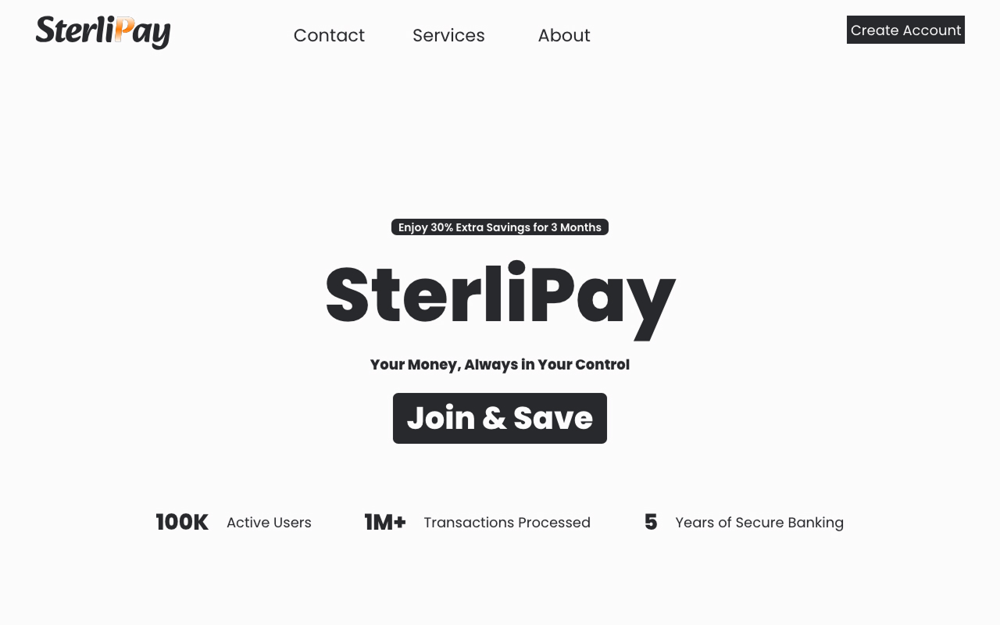

## SterliPay: A Responsive banking web app

### Technologies
- React+Vite
- Typescript
- Tailwind CSS
- Motion

### Live: [http://sterlipay.netlify.app](http://sterlipay.netlify.app/)

#### Preview



### Features
- Responsive design for mobile and desktop.
- Smooth animations and transitions using Motion.
- Sign-up and sign-in forms

##### Installation:
1. **Clone the repository**: 
   ```bash
   git clone https://github.com/f-hossen/sterlipay-react.git
   cd sterlipay-react

2. Install dependencies:

 - **yarn:**
     ```bash
     yarn
     ```
     <button onclick="navigator.clipboard.writeText('yarn')"></button>

- **npm:**
     ```bash
     npm install
     ```
     <button onclick="navigator.clipboard.writeText('npm install')"></button>

3. Start the development server:
  - **yarn:**
     ```bash
     yarn dev
     ```
     <button onclick="navigator.clipboard.writeText('yarn dev')"></button>

  - **npm:**
     ```bash
     npm run dev
     ```
     <button onclick="navigator.clipboard.writeText('npm run dev')"></button>

#### Author
[Farhad H.](https://f-hossen.vercel.app/)

#### License
This project is open source and available under the [MIT License](LICENSE)